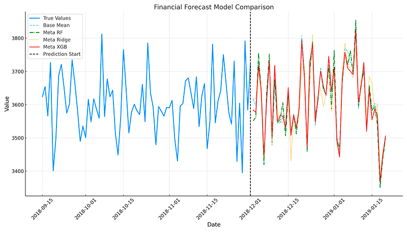
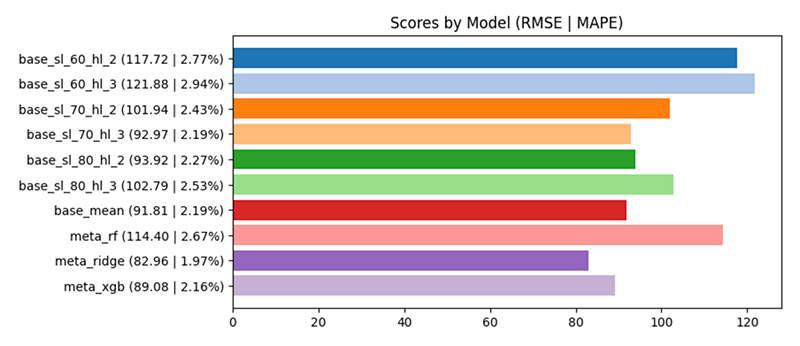

# TSEnsemble

A time series forecasting ensemble model designed to provide robust predictions by combining the strengths of multiple forecasting learners. This project aims to improve forecast accuracy by leveraging the diversity of several underlying models.



## Features

- **Ensemble Approach**: Integrates multiple time series forecasting models to reduce prediction error.
- **Flexibility**: Easily extendable to include more models or adapt existing ones.
- **User-Friendly**: Simple interface for training the ensemble model and making predictions.

## How does it work

The TSEnsemble model operates through a systematic process of training and forecasting, which involves several key steps:

### Training Process

1. **Initialization**: The data series is normalized and split into three distinct sets: training, meta, and testing.
2. **Base Models Training**: Multiple configurations of recurrent neural networks (RNNs) are trained on the training set. This diversity in base models helps in capturing various patterns in the data. Each configuration is trained a number of times (bags) and the final predictions are averaged in order to reduce the variance.
3. **Meta Predictions Generation**: Each trained base model makes predictions on the meta set. These predictions are then used as features to train the meta models.
4. **Meta Models Training**: Meta models, which can be different types of regression models, are trained on the predictions from the base models. This step aims to combine the strengths of each base model to improve overall prediction accuracy.

The ensemble model incorporates three distinct meta regressors by default, each designed to identify and leverage various relationships within the dataset:

- **Random Forest**: Utilizes tree-based learning to handle non-linear data effectively.
- **Ridge Regression**: Linear regression with L2 regularization to capture linear relationships and manage multicollinearity.
- **XGBoost**: Gradient boosting regressor designed to optimize both bias and variance, suitable for complex pattern identification.


### Forecasting Process

1. **Initialization**: The forecast data is prepared and normalized.
2. **Base Models Forecasting**: Each base model configuration is used to make predictions on the forecast data.
3. **Base Models Mean Forecasting**: Predictions are made by averaging the results of each base model configuration.
4. **Meta Models Forecasting**: The predictions from the base models are then used as input to the meta models, which generate the final forecast.

This structured approach allows TSEnsemble to leverage the strengths of various machine learning models, providing a robust and accurate forecasting tool.

## Usage

This model is especially useful for time series data that have complex relationship between variables, like financial forecasting. The ensemble model can be used to predict future values of a time series based on the past values, while also considering the relationships between different variables.

Try the Jupyter notebook [`TSEnsemble.ipynb`](./TSEnsemble.ipynb) for a step-by-step guide on how to perform the training and forecasting using this model.

You can also train and forecast this model by running the [`ensemble.py`](./ensemble.py) script.

```bash
python ensemble.py
```

## Results

This are the results of the model using the `sample-fx.csv` dataset and forecasting for the next 60 days of EUR/COP exchange rates, starting in Nov. 27th, 2018, with the following parameters:

- 6 models combining 3 different sequence lengths (60, 70, 80) and 2 different number of hidden layers (2, 3).
- All models were trained 3 times (bags) and the final predictions are averaged, with 30 epochs and a learning rate of 0.01.
- Then 3 meta models were trained on the predictions from the base models (Random Forest, Ridge Regression, XGBoost).

We then evaluated the results of the ensemble model against the results of the base and meta models, so we can see if the ensemble model is able to capture the complex relationships between variables and improve the overall accuracy of the predictions.

In this case, one of the meta models (Ridge Regression) was the best performing model, along with another meta model (XGBoost), which were both better than all the base models, including the average of them all.



## Author

This model was created by [Luis Sancho](https://github.com/luissancho).
